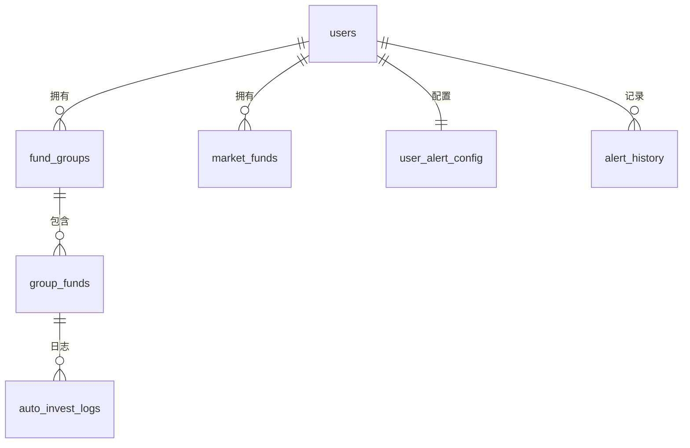

# FundTracker 项目文档

> 一站式公募基金追踪、持仓管理与智能分析平台

---

## 目录

1. [需求文档](#1-需求文档)
2. [技术架构](#2-技术架构)
3. [数据库设计](#3-数据库设计)
4. [接口文档](#4-接口文档)
5. [部署与环境变量](#5-部署与环境变量)

---

## 1. 需求文档

### 1.1 产品概述

FundTracker 是一款面向个人投资者的基金追踪与持仓管理 Web 应用，支持：
- 实时盘中估值监控（10 秒轮询）
- 基金分组管理与持仓记录
- 市场风向标（行业板块趋势矩阵图）
- 自动定投 + 涨跌收益计算（每日自动结算）
- AI 智能诊断与操作建议
- 实时财经快讯（东方财富 + 财联社）
- 涨跌幅邮件提醒

### 1.2 功能模块

#### 1.2.1 用户认证
| 功能 | 描述 |
|------|------|
| 注册/登录 | Supabase Auth，邮箱+密码 |
| 会话管理 | 自动监听 Auth 状态变化 |
| 数据隔离 | RLS 行级安全策略，用户只能访问自己的数据 |

#### 1.2.2 基金分组管理
| 功能 | 描述 |
|------|------|
| 创建/删除/重命名分组 | 支持多个自定义分组 |
| 添加/移除基金 | 通过基金代码搜索并添加 |
| 排序 | sort_order 字段控制展示顺序 |
| 市场风向标 | 特殊分组，独立 `market_funds` 表管理 |

#### 1.2.3 实时行情监控
| 功能 | 描述 |
|------|------|
| 盘中实时估值 | 东方财富 JSONP 接口，10 秒轮询 |
| QDII 降级 | 无实时估值时回退到历史净值 API |
| 技术指标 | RSI(14日)、波动率(20日)、最大回撤 |

#### 1.2.4 持仓管理
| 功能 | 描述 |
|------|------|
| 持仓金额录入 | 每只基金可设置持仓金额 |
| 定投配置 | 开关 + 每日定投金额 |
| 持仓重算 | 公式：`新金额 = 原金额 × (1 + 涨跌幅/100) + 定投金额` |
| 防重复更新 | 查询 auto_invest_logs 表判断当日是否已更新 |
| 更新日志 | 记录每次重算的原金额、收益、定投、新金额 |

#### 1.2.5 自动结算（Vercel Cron）
| 功能 | 描述 |
|------|------|
| 触发时间 | 每个工作日北京时间 15:30（UTC 07:30） |
| 执行逻辑 | 后端获取涨跌 → 计算收益+定投 → 更新数据库 → 写入日志 |
| 防重复 | last_auto_invest_date 字段 + 当日日期比对 |

#### 1.2.6 AI 功能
| 功能 | 描述 |
|------|------|
| AI 诊断建议 | 基于 RSI、回撤、定投状态给出操作建议 |
| 新闻 AI 分析 | 对财经快讯做情绪分析（利好/利空/中性） |
| 模型 | SiliconFlow API（DeepSeek-V3 / Qwen2.5-7B） |

#### 1.2.7 邮件提醒
| 功能 | 描述 |
|------|------|
| 阈值配置 | 用户自定义涨跌阈值（默认 ±2%） |
| 发送频率 | 同一基金每日最多 2 封 |
| 邮件通道 | QQ 邮箱 SMTP SSL |

#### 1.2.8 实时快讯
| 功能 | 描述 |
|------|------|
| 东方财富快讯 | 搜索 API，支持关键词过滤 |
| 财联社电报 | 电报列表 API，支持关键词过滤 |
| AI 解读 | 一键调用 AI 分析新闻情绪与影响板块 |

---

## 2. 技术架构

### 2.1 技术栈

| 层级 | 技术 |
|------|------|
| **前端** | React 19 + Vite 7 |
| **UI 组件** | 纯 CSS + Lucide Icons + Recharts |
| **后端** | Vercel Serverless Functions（Python + Node.js） |
| **数据库** | Supabase (PostgreSQL) |
| **认证** | Supabase Auth |
| **AI** | SiliconFlow API |
| **邮件** | QQ SMTP |
| **部署** | Vercel（自动部署 + Cron Jobs） |

### 2.2 目录结构

```
fundProject/
├── api/                          # Vercel Serverless Functions
│   ├── auto_invest.py            # 自动持仓重算（Cron + 手动）
│   ├── alerts_check.py           # 涨跌邮件提醒检查
│   ├── ai.py                     # 新闻 AI 情绪分析
│   ├── ai_advice.py              # 基金 AI 诊断建议
│   ├── news.py                   # 东方财富快讯代理
│   ├── news_cls.py               # 财联社电报代理
│   ├── f10-proxy.js              # 基金历史净值代理
│   ├── pingzhong-proxy.js        # 基金详情/走势代理
│   └── stock-proxy.js            # 股票行情代理（腾讯）
├── src/
│   ├── App.jsx                   # 主应用入口
│   ├── main.jsx                  # React 挂载点
│   ├── pages/
│   │   └── AuthPage.jsx          # 登录/注册页
│   ├── components/
│   │   ├── FundCard.jsx          # 基金卡片（估值/指标/持仓）
│   │   ├── FundManager.jsx       # 配置管理面板（分组/定投/重算）
│   │   ├── FundPerspective.jsx   # 基金透视（走势图/持仓/分析）
│   │   ├── FundSearch.jsx        # 基金搜索框
│   │   ├── MarketCompass.jsx     # 市场风向标（趋势-位置矩阵）
│   │   ├── NewsBoard.jsx         # 实时快讯面板
│   │   ├── PositionModal.jsx     # 持仓编辑弹窗 + 更新记录
│   │   └── AIDiagnosticModal.jsx # AI 诊断结果弹窗
│   ├── services/
│   │   ├── fundApi.js            # 东方财富 API 封装（行情/走势/持仓）
│   │   ├── supabaseClient.js     # Supabase 客户端初始化
│   │   └── supabaseHelpers.js    # 数据库 CRUD 操作封装
│   └── config/
│       └── funds.json            # 市场风向标基金配置
├── vercel.json                   # Vercel 路由重写 + Cron 配置
├── package.json                  # 前端依赖
└── requirements.txt              # Python 依赖
```

### 2.3 数据流

```
用户浏览器 ──→ Vite 前端 ──→ Vercel Serverless ──→ 东方财富 API
                  │                   │                  腾讯行情 API
                  │                   │                  SiliconFlow AI
                  │                   │                  QQ SMTP
                  └───── Supabase ◄───┘
                        (PostgreSQL + Auth)
```

---

## 3. 数据库设计

### 3.1 ER 关系图



### 3.2 表结构

#### `fund_groups` — 基金分组

| 字段 | 类型 | 约束 | 说明 |
|------|------|------|------|
| `id` | bigint | PK, AUTO | 分组 ID |
| `user_id` | uuid | FK → auth.users, NOT NULL | 所属用户 |
| `name` | text | NOT NULL | 分组名称 |
| `is_market` | boolean | DEFAULT false | 是否为市场风向标分组 |
| `sort_order` | integer | DEFAULT 0 | 排序序号 |
| `created_at` | timestamptz | DEFAULT now() | 创建时间 |

**RLS 策略**：`user_id = auth.uid()`

---

#### `group_funds` — 分组内基金（持仓信息）

| 字段 | 类型 | 约束 | 说明 |
|------|------|------|------|
| `group_id` | bigint | FK → fund_groups.id, ON DELETE CASCADE | 所属分组 |
| `fund_code` | text | NOT NULL | 基金代码（如 `001632`） |
| `sort_order` | integer | DEFAULT 0 | 组内排序 |
| `amount` | numeric | DEFAULT 0 | 持仓金额（元） |
| `is_auto_invest` | boolean | DEFAULT false | 是否开启定投 |
| `auto_invest_amount` | numeric | DEFAULT 0 | 每日定投金额 |
| `last_auto_invest_date` | date | NULL | 上次结算日期（防重复） |

**主键**：`(group_id, fund_code)` 联合主键

---

#### `market_funds` — 市场风向标板块

| 字段 | 类型 | 约束 | 说明 |
|------|------|------|------|
| `id` | bigint | PK, AUTO | 记录 ID |
| `user_id` | uuid | FK → auth.users, NOT NULL | 所属用户 |
| `fund_code` | text | NOT NULL | 基金代码 |
| `short_name` | text | NULL | 板块简称（如"半导体"） |
| `sort_order` | integer | DEFAULT 0 | 排序序号 |

---

#### `auto_invest_logs` — 持仓更新日志

| 字段 | 类型 | 约束 | 说明 |
|------|------|------|------|
| `id` | bigint | PK, AUTO | 日志 ID |
| `group_id` | bigint | NOT NULL | 分组 ID |
| `fund_code` | text | NOT NULL | 基金代码 |
| `date` | date | NOT NULL | 结算日期 |
| `old_amount` | numeric | DEFAULT 0 | 更新前金额 |
| `amount_added` | numeric | DEFAULT 0 | 当日收益（原金额×涨跌幅/100） |
| `invest_amount` | numeric | DEFAULT 0 | 当日定投金额 |
| `total_amount` | numeric | DEFAULT 0 | 更新后总金额 |
| `created_at` | timestamptz | DEFAULT now() | 记录时间（北京时间） |

**展示格式**：`原金额 + (收益) + 定投 = 更新后金额`

---

#### `user_alert_config` — 用户提醒配置

| 字段 | 类型 | 约束 | 说明 |
|------|------|------|------|
| `user_id` | uuid | PK, FK → auth.users | 用户 ID |
| `is_enabled` | boolean | DEFAULT true | 是否开启提醒 |
| `threshold` | numeric | DEFAULT 2.0 | 涨跌幅阈值（%） |
| `email_receiver` | text | DEFAULT '' | 接收邮箱（空则用注册邮箱） |
| `updated_at` | timestamptz | NULL | 最后更新时间 |

---

#### `alert_history` — 提醒发送历史

| 字段 | 类型 | 约束 | 说明 |
|------|------|------|------|
| `id` | bigint | PK, AUTO | 记录 ID |
| `user_id` | uuid | FK → auth.users | 用户 ID |
| `fund_code` | text | NOT NULL | 基金代码 |
| `change_val` | numeric | NULL | 触发时的涨跌幅 |
| `sent_at` | timestamptz | DEFAULT now() | 发送时间 |

---

## 4. 接口文档

### 4.1 前端代理接口（Vercel Rewrites）

通过 `vercel.json` 的 rewrites 规则代理东方财富 API，解决跨域问题。

#### 基金实时估值
```
GET /api/fund/{code}.js
代理 → http://fundgz.1234567.com.cn/js/{code}.js
返回：JSONP 格式 jsonpgz({fundcode, name, gszzl, gsz, dwjz, jzrq, gztime})
- gszzl: 估算涨跌幅(%)
- gsz: 估算净值
- dwjz: 昨日净值
```

#### 基金详情/走势
```
GET /api/pingzhong/{code}.js
代理 → http://fund.eastmoney.com/pingzhong/{code}.js（经 proxy 转发）
返回：JS 变量赋值，包含 Data_ACWorthTrend / Data_netWorthTrend
```

#### 基金历史净值
```
GET /api/f10/lsjz?fundCode={code}&pageIndex=1&pageSize=1
代理 → http://api.fund.eastmoney.com/f10/lsjz
返回：JSON { Data: { LSJZList: [{ DWJZ, FSRQ, JZZZL }] } }
- JZZZL: 净值增长率(%)
```

#### 股票实时行情
```
GET /api/stock?q=sh600519,sz000001
代理 → http://qt.gtimg.cn/q={codes}
返回：腾讯行情文本格式
```

---

### 4.2 后端 Serverless Functions

#### 4.2.1 `POST /api/auto_invest`（持仓自动重算）

**触发方式**：
- Vercel Cron：每工作日 UTC 07:30（北京时间 15:30）
- 手动触发：`GET /api/auto_invest?manual=true`

**执行流程**：
1. 从 Supabase 获取所有 `amount > 0` 的基金
2. 并发调用东方财富 API 获取每只基金涨跌幅
3. 计算：`新金额 = 原金额 + (原金额 × 涨跌/100) + 定投`
4. 更新 `group_funds.amount` + `last_auto_invest_date`
5. 批量写入 `auto_invest_logs` 日志

**响应示例**：
```json
{
  "success": true,
  "date": "2026-04-24",
  "processed": 12,
  "skipped": 3,
  "no_data": 1,
  "failed": 0,
  "details": ["ok:001632: 10000 + (+45.2) = 10045.2", "skipped:110011"]
}
```

---

#### 4.2.2 `GET /api/alerts_check`（涨跌邮件提醒）

**触发方式**：Vercel Cron 或手动

**执行流程**：
1. 查询所有 `is_enabled=true` 的用户提醒配置
2. 收集用户关注的基金代码（排除市场风向标）
3. 并发获取实时涨跌幅
4. 超过阈值 → 检查 `alert_history`（每日限 2 封）→ 发邮件 → 写历史

**响应示例**：
```json
{
  "success": true,
  "count": 2,
  "results": ["sent:001632(3.5%) -> user@qq.com"]
}
```

---

#### 4.2.3 `POST /api/ai_advice`（AI 诊断建议）

**请求体**：
```json
{
  "fund_name": "前海开源沪港深优势精选",
  "amount": 10000,
  "est_change": 1.5,
  "drawdown": -15.2,
  "rsi": 28,
  "is_auto_invest": true
}
```

**响应体**：
```json
{
  "success": true,
  "data": {
    "action": "逢低补仓",
    "confidence": 85,
    "reasoning": "RSI跌破30且属定投，左侧极寒期正是攒份额良机，建议加码补仓。"
  }
}
```

**动作词库**：逢低补仓 | 分批建仓 | 保持定投 | 持仓待涨 | 止盈止损 | 暂停定投

---

#### 4.2.4 `POST /api/ai`（新闻 AI 情绪分析）

**请求体**：
```json
{
  "title": "新闻标题",
  "content": "新闻内容"
}
```

**响应体**：
```json
{
  "success": true,
  "data": {
    "sentiment": "利好",
    "score": 85,
    "summary": "一句话摘要",
    "impact": ["半导体", "人工智能"]
  }
}
```

---

#### 4.2.5 `GET /api/news`（东方财富快讯）

**参数**：`keyword`（默认 `A股`）

**响应体**：
```json
{
  "success": true,
  "data": [
    { "time": "2026-04-24 10:30", "title": "标题", "content": "内容", "url": "链接" }
  ]
}
```

---

#### 4.2.6 `GET /api/news_cls`（财联社电报）

**参数**：`keyword`（默认 `A股`）

**响应格式**：同上

---

### 4.3 前端 Supabase 操作（supabaseHelpers.js）

| 函数 | 说明 |
|------|------|
| `fetchGroups()` | 获取用户所有分组 + 基金列表 + 持仓信息 |
| `createGroup(name, isMarket, sortOrder)` | 创建新分组 |
| `deleteGroup(groupId)` | 删除分组（级联删除） |
| `renameGroup(groupId, newName)` | 重命名分组 |
| `addFundToGroup(groupId, fundCode, sortOrder)` | 添加基金到分组 |
| `removeFundFromGroup(groupId, fundCode)` | 移除基金 |
| `updateFundPosition(groupId, fundCode, amount, isAutoInvest, autoInvestAmount)` | 更新持仓信息 |
| `fetchMarketFunds()` | 获取市场风向标板块列表 |
| `addMarketFund(fundCode, shortName, sortOrder)` | 添加板块 |
| `removeMarketFund(fundCode)` | 移除板块 |
| `renameMarketFund(fundCode, newShortName)` | 重命名板块 |
| `fetchAlertConfig()` | 获取提醒配置 |
| `updateAlertConfig(config)` | 更新提醒配置（upsert） |
| `fetchAutoInvestLogs(fundCode)` | 获取指定基金的更新日志 |
| `batchUpdatePositions(updates, todayStr)` | 批量更新持仓金额 |
| `insertPositionUpdateLogs(logs)` | 批量写入更新日志 |

---

## 5. 部署与环境变量

### 5.1 环境变量

| 变量名 | 用途 | 配置位置 |
|--------|------|----------|
| `VITE_SUPABASE_URL` | Supabase 项目 URL | 前端 + Vercel |
| `VITE_SUPABASE_ANON_KEY` | Supabase Anon Key（前端） | 前端 + Vercel |
| `SUPABASE_SERVICE_KEY` | Supabase Service Role Key（后端） | 仅 Vercel |
| `SMTP_HOST` | 邮件服务器地址 | Vercel |
| `SMTP_PORT` | 邮件服务器端口 | Vercel |
| `SMTP_USER` | 邮箱账号 | Vercel |
| `SMTP_PASS` | 邮箱授权码 | Vercel |
| `SMTP_FROM` | 发件人地址 | Vercel |
| `CRON_SECRET` | Cron 安全密钥 | Vercel |

### 5.2 Vercel Cron 配置

```json
{
  "crons": [
    {
      "path": "/api/auto_invest",
      "schedule": "30 7 * * 1-5"
    }
  ]
}
```

> ⚠️ Vercel Cron 的 schedule 使用 **UTC 时间**，`30 7` = UTC 07:30 = **北京时间 15:30**

### 5.3 Supabase 建表 SQL（关键字段扩展）

```sql
-- 持仓更新日志扩展字段
ALTER TABLE auto_invest_logs 
  ADD COLUMN IF NOT EXISTS old_amount numeric DEFAULT 0,
  ADD COLUMN IF NOT EXISTS invest_amount numeric DEFAULT 0;
```

### 5.4 本地开发

```bash
# 安装依赖
npm install

# 启动开发服务器
npm run dev

# 构建生产版本
npm run build
```

---

*文档版本：v1.0 | 最后更新：2026-04-24*
